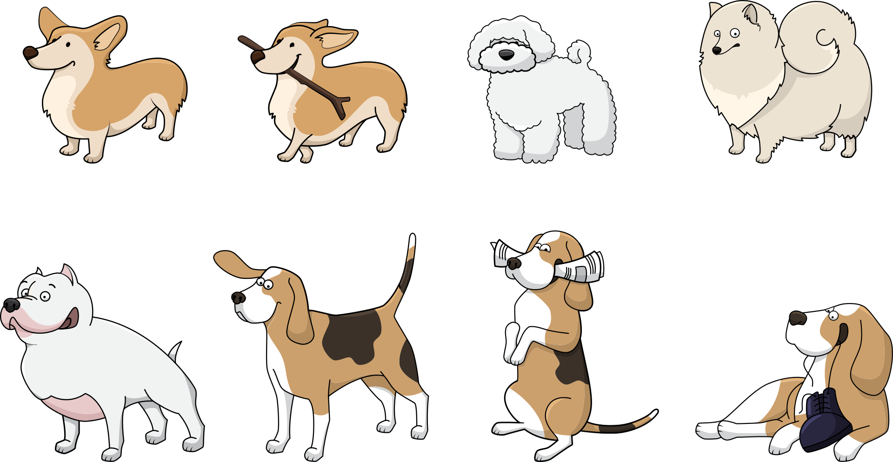

# BeagleBone Stuff

A collection of tiny embedded-linux projects for the BeagleBone Black (BBB).  



## Details about the BBB and the OS

Processor: AM3358 ARM Cortex-A8

OS: Debian 10.3 Buster IoT (without graphical desktop)

Kernel release: 4.19.94-ti-r42

GCC version: 8.3.0

Link to the official docs [here](https://github.com/beagleboard/beaglebone-black/wiki/System-Reference-Manual)

## Setup

I recommend reading [`cross-compilation-setup/README.md`](./cross-compilation-setup) first.  
It explains how I set up my computer (Mac M1) to cross compile programs for the board and upload them there.  

## Building

The project uses a [global CMake file](./CMakeLists.txt) with different targets.  
Dependencies are managed through [Conan](./conanfile.txt).  
The file [`profile_crossbuild`](./profile_crossbuild) tells the latter which platform we're generating binary files for.

To build:

```sh
mkdir build
cd build

conan install .. --build=missing --profile=../profile_crossbuild

cmake .. -G "Unix Makefiles" -DCMAKE_BUILD_TYPE=Build
cmake --build .
```

The executables will be placed in `build/bin`.

For debugging purposes, you may want to build the projects for the local VM too.  
To avoid future headaches, adjust your Conan profile to [use the CXX11 ABI by default](https://docs.conan.io/en/latest/howtos/manage_gcc_abi.html#manage-gcc-abi) before proceeding.  
Then, to build:

```sh
mkdir build
cd build

conan install .. --build=missing

cmake .. -G "Unix Makefiles" -DCMAKE_BUILD_TYPE=Build -DBUILD_LOCAL=1
cmake --build .
```

<ins>Exception:</ins> the project `onboard-leds` is built using a [regular `Makefile`](./onboard-leds/Makefile), so `cd` into the directory and simply call `make`.

<ins>Exception:</ins> the project `writing-lkm` uses `Kbuild`; check [its README](./writing-lkm) for details.

## The projects

Here are the projects, in the order they've been developed:

* [`onboard-leds`](./onboard-leds): play with the onboard LEDs (turn on, turn off, flash)

* [`gpio`](./gpio): a cli utility that allows changing direction, pull-up/down resistor, and value of gpio pins

* [`using-lkm`](./using-lkm): use the pre-built LKM to read a temperature sensor (I2C)

* [`i2c`](./i2c): use system calls to read a temperature sensor (I2C) 

* [`ifttt`](./ifttt): use the [*IFTTT*](https://ifttt.com/explore) web service, and set up a cron daemon

* [`mqtt`](./mqtt): publish data to Adafruit's MQTT broker (or to a local Mosquitto broker)

* [`watchdog`](./watchdog): use the watchdog timer to reboot the board after 30 seconds of inactivity

* [`writing-lkm`](./writing-lkm): write a tiny loadable kernel module

Others:

* [`dotenv`](./dotenv/lib.cpp): a tiny static library used to parse the [`.env`](./.env) file

## ASIDE: The dogs...

The [nice cartoon sketch](https://pixabay.com/vectors/dog-animal-corgi-beagle-bolonka-1417208/) is offered by Pixabay users under their [generous free license](https://pixabay.com/service/license/).
